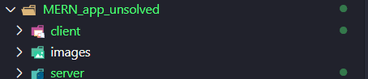
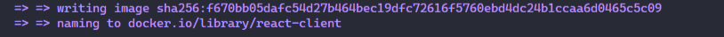
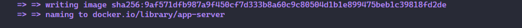
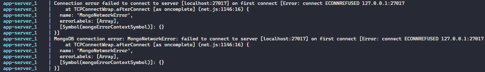
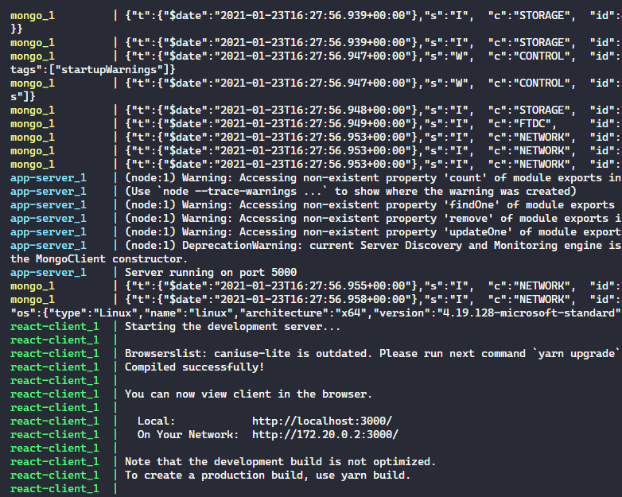

# Dockerize a MERN Stack Application

[Introduction Video](https://youtu.be/u21sT9jVhMA)

Welcome to Dockerizing a MERN Stack application! In this short course, we are going to harness the power of Docker and docker-compose to setup a complete MERN environment, allowing us to run a simple movie application. This course assumes you have extensive knowledge in MERN Stack development, and only a basic understanding of `Dockerfiles` and `docker-compose.yml` syntax. If either of those don't seem familiar to you, head on over to the documentation to learn more:

* [Docs on Dockerfile](https://docs.docker.com/engine/reference/builder/)
* [Docs on compose files v3](https://docs.docker.com/compose/compose-file/compose-file-v3/)

Setting up development environments can be a pretty grueling task, and having your application behave exactly the same on every developer's machine is a big ask. Enter Docker. We will create a full environment with which we can create full MERN applications without ever having to install the softwares directly to our machine.

By following the steps laid out in this scenario, you'll learn how to create Docker images for the frontend and backend of a full stack application. You'll then learn to use docker-compose to run those images in unison while provisioning a database to run your app with no installs. In the end, you'll be able to start up your entire environment with a single command, `docker-compose up`

Let's get to it!

## Check out our MERN app

First, lets open `MERN_app_unsolved` in our IDE and inspect its contents. Great! We have a client and a server, both wired up to speak to each other.



Whenever we want to run this application, we would have to ensure the machine was running the proper environment. This would mean checking for `Node` and `MongoDB` installations, and proper configuration of both. What if we or our user don't have those things setup or installed?

In comes Docker. Docker can be used to create our environment with zero browser navigation or installation links. With the proper setup, we could ensure that anyone who cloned this repository could build and run this app as long as they had Docker installed on their machine. This could save us a lot of headaches, so let's give it a shot.

## Build Client Dockerfile

With the `MERN_app_unsolved` directory open in your IDE, navigate to your terminal and enter the following command:

```bash
cd client/
```

Let's quickly check if we have any Docker containers already running on this machine:

```bash
docker ps
```

Alrght, no containers in sight! Now let's make a new `Dockerfile`:

```bash
touch Dockerfile
```

Copy and paste the following code into your newly created `Dockerfile` inside of `client`:

```dockerfile
FROM node:14-slim

WORKDIR /usr/src/app

COPY ./package.json ./
COPY ./yarn.lock ./

RUN yarn install

COPY . .

EXPOSE 3000

CMD ["yarn", "start"]
```

Great! Now let's quickly take a look at the code we entered.

First, we chose the base image `FROM` which we would like to build our container. In this case we chose `node:14-slim`. The `-slim` tag denotes we are obtaining an image that contains only the necessities to run `node`.

Next, we set our `WORKDIR` or working directory to be `/usr/src/app`. This directory is where `RUN`, `CMD`, and `COPY` instructions will execute. So, we then copy all of the contents of `package.json` and `yarn.lock` into our `WORKDIR` via `./`.

We can then run `yarn install`. After its complete we `COPY` all of the contents from our src `.` and get it all copied to our container `.`. 

By using the `EXPOSE` instruction we can let Docker know the container needs to listen on the exposed port when we run our dockerfile. Finally, just like we would do normally we use the `CMD` or command instruction to run `yarn start`.

Thankfully, the `Dockerfile` for our `server` is going to look quite similar, with only two minor differences. What do you think those differences could be?

<details>

  <summary> Click here to see the answer!</summary>

If you thought that the `EXPOSE` and `CMD` instructions would be different, great job! 
</details>

Let's go ahead and navigate to `MERN_app_unsolved/server` and create a new Dockerfile:

```bash
cd ..
cd /server/
touch Dockerfile
```

Enter the following contents into the new `server/Dockerfile`, noting the differences:

```dockerfile
FROM node:14-slim

WORKDIR /usr/src/app

COPY ./package.json ./
COPY ./yarn.lock ./

RUN yarn install

COPY . .

EXPOSE 5000

CMD [ "index.js" ]
```

For our server, we want to expose a different port, so we expose `5000`. We then give the `CMD` instruction of `index.js` to spin up the server. 

Awesome! Now that we have two Dockerfiles, how would we go about building both of them and giving them the names `react-client` and `app-server`, respectively?

<details>
  <summary>Click see the answer!</summary>

  * We would run the following two commands from the root of the `MERN_app_unsolved` directory:

  ```bash
  docker build -t react-client ./client/
  docker build -t app-server ./server/
  ```

</details>

Let's first run `docker build -t react-client ./client/`. Depending on your machine, this could take anywhere from 30 seconds to 3 minutes. On completion you should see something similar to the following output:



Next, run `docker build -t app-server ./server`. On completion you should see something similar to the following output:



Excellent! Now we have a client container running our frontend, and a server container running our backend server...this is great! There is just one thing we are forgetting.

We need a database! What if I told you we could provision a database, all while running our two containers in tandem? We can do exactly that with `docker-compose`. All we need to do is create and configure a `docker.compose.yml` file at the root of `MERN_app_unsolved` and we are good to go! Create that `docker-compose.yml` now.

```bash
touch docker-compose.yml
```

Copy and paste the following contents into that newly created file and then we will go over the contents:

```yml
version: "3.4"
services:
  react-client:
    image: react-client
    stdin_open: true
    ports:
      - "3000:3000"

  app-server:
    image: app-server
    ports:
      - "5000:5000"
    depends_on: 
      - mongo

  mongo:
    image: mongo:latest
    ports:
      - "27017:27017"
```

Wow! At first glance, that seems like a lot; however, it's actually a lot of repetition. Let's start at the top. Our `services` are the 3 containers we would like to run, our `react-client`, `app-server`, and `mongo`. The first property in each of the services is the `image` we want to create the container based on. In this instance we use the two builds we made, `react-client` and `app-server`. 

For mongo, we use DockerHub to pull the `latest` version of `mongo`. What does the `latest` tag denote?

<details>
  <summary> Recall time! Click here to see if you know </summary>

  `latest` will be the current LTS version of an image from DockerHub

</details>

We setup public ports for port binding with `ports`. The only differences is in our `react-client` container we use the `stdin_open: true` option to keep it open for requests after starting our environment. The last step for us is to set the `depends_on` option in `app-server` to `- mongo`. This is because our server needs to connect to MongoDB, we can specify this depends on so that `mongo` will start first. Well...thats it! Let's enter that final command at the root of `MERN_app_unsolved`:

```bash
docker-compose up
```

Hmmm...interesting....our server seems to be failing. Let's take a look at the stack trace and see whats going on.



Aha! So you can see when our server tried connecting to our mongo container, the connection was refused. More specifically we received: `Connection error failed to connect to server [localhost:27017]` This is because in our current server setup, our server is expecting to connect with MongoDB via `localhost:27017`, but we have changed that designated port in the host to our `mongo` container. To fix this, let's navigate to `MERN_app_unsolved/server/db/index.js` and change the line that reads:

```js
.connect('mongodb://localhost:27017/cinema', { useNewUrlParser: true })
```

to be 

```js
.connect('mongodb://mongo/cinema', { useNewUrlParser: true })
```

Okay, that should solve our connection problem. Since we made a change to our server folder, let's rebuild our image before we continue. Navigate back to the root of `MERN_app_unsolved` and run the following in your terminal:

```bash
docker build -t app-server ./server/
```

You are going to see a whole lot of activity. This is all of your containers spinning up based on the images we specified! You'll see `mongo`, `app-server`, and finally `react-client`!



You'll see that your app is running on `http://localhost:3000/`, navigate to it on your browser and interact with the fully Dockerized MERN Stack application!

## Finished!

Excellent job. In less than 15 minutes we took a MERN stack application and fully set it up to run using Docker and docker-compose. With this setup, this repository could be cloned on any machine running docker, and once the images are built a simple `docker-compose up` will start the application with no installations needed. Fantastic!

In this short course you learned to:

* Use Dockerfiles to create separate frontend and backend container images
* Use docker-compose to run those container images in tandem
* Use docker-compose to pull mongo from DockerHub to also run in your project

Pat yourself on the back, that was more work than you think!

Go ahead and take this quick and shot [Quiz on Docker and docker-compose](https://docs.google.com/forms/d/e/1FAIpQLSdyAtfYiyNe1krzXATkMt3e3B5J1ZY9rK3hdb5skL9Pg_rn_g/viewform?usp=sf_link) to quicky test some basic knowledge!
